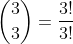

<h1>LeetCode Problem: Climbing Stairs</h1>

The problem description states that you are climbing a stair case. It takes <i>n</i> steps to reach to the top.
Each time you can either climb 1 or 2 steps. 
In how many distinct ways can you climb to the top?
(The problem can be found at <a href="https://leetcode.com/problems/climbing-stairs/">https://leetcode.com/problems/climbing-stairs/</a>.)

I found this problem really interesting, because the heart of the problem is combinatorics.
There are ways of solving this problem without using combinatorial algorithms, but combinatorics can solve the bigger more general problem of
climbing stairs using any length of steps less than <i>n</i>.

<h2>Solution for Original Problem</h2>

  Let's first take an example with <i>n</i>=3. Our first solution is 1, 1, 1. We then also have 1, 2 and 2, 1 as <i>different</i> distinct solutions. Since 1, 2 and 2, 1 are considered different solutions, these are permutations of the set {1, 2}.

We now make our first observation: we are looking for permutations of {1, 1, 1, ..., 2, 2, 2, ...} where the sum of set is equal to <i>n</i>. Permuting a set with  repeated elements calls for the use of multinomial coefficients, c.f. <a href="https://en.wikipedia.org/wiki/Multinomial_theorem">Multinomial Theorem</a> and <a href="https://en.wikipedia.org/wiki/Multinomial_theorem#Number_of_unique_permutations_of_words">Number of Unique Permutations of Words</a>. 

  

  From our example with <i>n</i>=3, we are looking for the number of permutations of {1, 2}. We then have:

  ,
  which is equal to 2. The other solution is {1, 1, 1}, which the number of permutations of {1, 1, 1} can still be found by using the multinomial coefficient. Since we have 3 total objects and the 1 is repeated three times, we have:
  .

  For other <i>n</i>, we note that <i>n</i> 1s a solution. This solutions can be counted as having <i>n</i> 1s and 0 2s. To get the next group of solutions, we decrement the number of 1s by 2 and increment the number of 2s by 1. This will ensure that our sum is still equal to <i>n</i>, and we have our numbers for couting the number of permutations of 1 and 2. Thus we make a variable to hold the number of 1s and another to keep track of the number of 2s. Our algorithm stops when we can no longer add any more number of 2s to the solution. 

<pre>
<code>
class Solution:
  def climbStairs(self, n: int) -> int:
    def multinomial(n, r1, 42):
      return int(math.factorial(n)/(math.factorial(r1)*math.factorial(r2)))
    #number of solutions
    s = 0
    #number of 2s
    x = 0
    #number of 1s
    y = n
    while y >= 0:
      s = s + multinomial(n, y, x)
      #we are taking two 1s from the set, but adding one 2, thus n decreases by 1 each iteration
      n = n - 1
      y = y - 2
      x = x + 1
    return s
</code>
</pre>

<h2>Solution for General Problem</h2>

  

