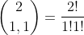
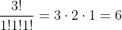
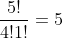

<h1>LeetCode Problem: Climbing Stairs</h1>

The problem description states that you are climbing a stair case. It takes <i>n</i> steps to reach to the top.
Each time you can either climb 1 or 2 steps. 
In how many distinct ways can you climb to the top?
(The problem can be found at <a href="https://leetcode.com/problems/climbing-stairs/">https://leetcode.com/problems/climbing-stairs/</a>.)

I found this problem really interesting, because the heart of the problem is combinatorics.
There are ways of solving this problem without using combinatorial algorithms, but combinatorics can solve the bigger more general problem of
climbing stairs using any length of steps less than <i>n</i>.

<h2>Solution for Original Problem</h2>

  Let's first take an example with <i>n</i>=3. Our first solution is 1, 1, 1. We then also have 1, 2 and 2, 1 as <i>different</i> distinct solutions. Since 1, 2 and 2, 1 are considered different solutions, these are permutations of the set {1, 2}.

We now make our first observation: we are looking for permutations of {1, 1, 1, ..., 2, 2, 2, ...} where the sum of set is equal to <i>n</i>. Permuting a set with  repeated elements calls for the use of multinomial coefficients, c.f. <a href="https://en.wikipedia.org/wiki/Multinomial_theorem">Multinomial Theorem</a> and <a href="https://en.wikipedia.org/wiki/Multinomial_theorem#Number_of_unique_permutations_of_words">Number of Unique Permutations of Words</a>. 

  

  From our example with <i>n</i>=3, we are looking for the number of permutations of {1, 2}. We then have:

  ,
  which is equal to 2. Note that the formulat arises from having 2 symbols, 1 is repeated 1 time and the 2 is repeated 1 time. The other solution is {1, 1, 1}, which the number of permutations of {1, 1, 1} can still be found by using the multinomial coefficient. Since we have 3 total objects and the 1 is repeated three times, we have:
  .

  For other <i>n</i>, we note that <i>n</i> 1s a solution. This solutions can be counted as having <i>n</i> 1s and 0 2s. To get the next group of solutions, we decrement the number of 1s by 2 and increment the number of 2s by 1. This will ensure that our sum is still equal to <i>n</i>, and we have our numbers for couting the number of permutations of 1 and 2. Thus we make a variable to hold the number of 1s and another to keep track of the number of 2s. Our algorithm stops when we can no longer add any more number of 2s to the solution. 

<pre>
<code>
class Solution:
  def climbStairs(self, n: int) -> int:
    def multinomial(n, r1, 42):
      return int(math.factorial(n)/(math.factorial(r1)*math.factorial(r2)))
    #number of solutions
    s = 0
    #number of 2s
    x = 0
    #number of 1s
    y = n
    while y >= 0:
      s = s + multinomial(n, y, x)
      #we are taking two 1s from the set, but adding one 2, thus n decreases by 1 each iteration
      n = n - 1
      y = y - 2
      x = x + 1
    return s
</code>
</pre>

<h2>Solution for General Problem</h2>

  Excluding any physical limitation of the number of steps you can take at once, the collection of the possible steps to get to the top is a partition of <i>n</i>. For example, if <i>n</i>=6, the collection of steps would be given by <i>S</i> = {{6}, {5, 1}, {4, 2}, {4, 1, 1}, {3, 3}, {3, 2, 1}, {3, 1, 1}, {2, 2, 2}, {2, 2, 1, 1}, {2, 1, 1, 1, 1}, {1, 1, 1, 1, 1, 1}}. Then for each set in <i>S</i>, we can reorder the steps to get more solutions. For example, {3, 2, 1} would yield {3, 2, 1}, {3, 1, 2}, {2, 3, 1}, {2, 1, 3}, {1, 2, 3}, {1, 3, 2} while {2, 1, 1, 1, 1} would {2, 1, 1, 1, 1}, {1, 2, 1, 1, 1}, {1, 1, 2, 1, 1}, {1, 1, 1, 2, 1}, and {1, 1, 1, 1, 2}. Finding all the solutions from a set in <i>S</i>  is essentially what we were finding in the first part: finding the number of permutations with repeated elements. From our previous example, the number of permutations of {3, 2, 1} is 

,

 and similarly for {2, 1, 1, 1, 1} we have 

.

  Thus we need an algorithm for computing the partitions of an integer and another for computing the multinomial coefficient. Calculating integer partitions can be done with recursion. We start with <i>n</i> and "break" into smaller pieces on each successive call. While we compute each partition, we keep track of the number of times each symbol is used in a dictionary. Keeping track of the symbol count will be necessary for evaluating the multinomial coefficient for each partition. Thus the program in a nutshell is two steps:

<ol>
  <li>Calculate partitions of <i>n</i></li>
  <ul>
    <li>keep track of the symbol count for each partition</li>
    <li>discard any partition that uses disallowed steps</li>
  </ul>
  <li>Calculate multionomail coefficient for each parition found in step 1</li>
</ol>

